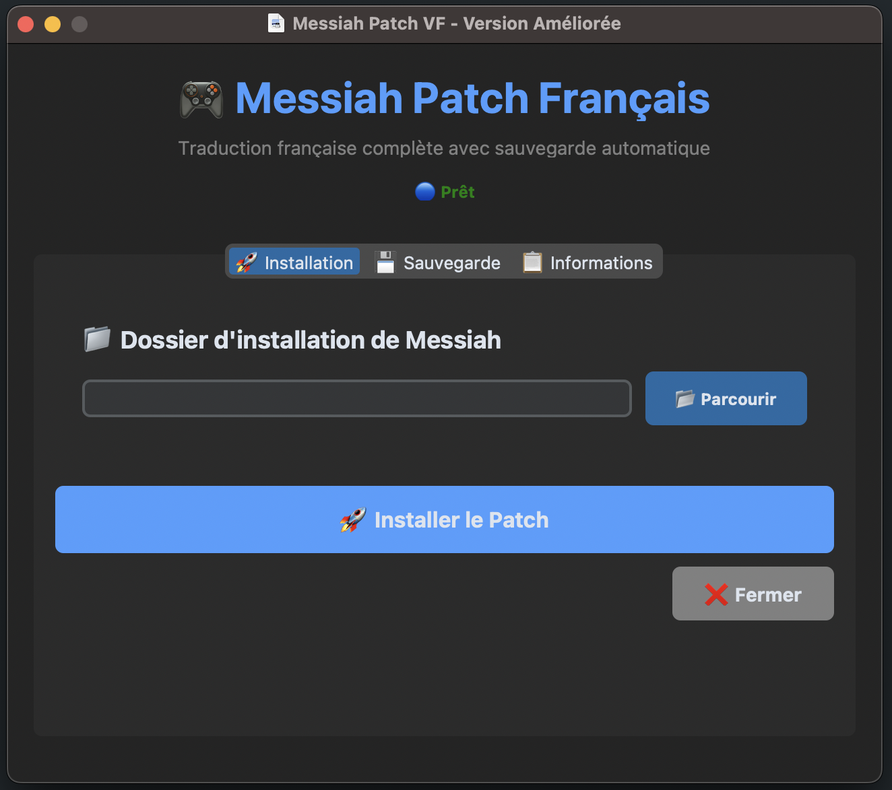

> **Messiah-VF-Patch est un projet Python visant à fournir les voix et textes en français pour le jeu Messiah.**

[](https://www.microsoft.com/ "Go to Microsoft homepage")
[](https://github.com/Aiola13/Messiah-VF-Patch/releases/)
[](https://python.org "Go to Python homepage")
[](#license)
[](https://visitorbadge.io/status?path=https%3A%2F%2Fgithub.com%2FAiola13%2FMessiah-VF-Patch)


[](https://github.com/features/actions "Go to GitHub Actions homepage")
[](https://github.com/Aiola13/Messiah-VF-Patch)
[](https://github.com/Aiola13/Messiah-VF-Patch)

---

## 📋 Table des matières

- [🎯 Aperçu](#-aperçu)
- [✨ Fonctionnalités](#-fonctionnalités)
- [🚀 Installation rapide](#-installation-rapide)
- [💻 Utilisation](#-utilisation)
- [🛡️ Sécurité](#️-sécurité)
- [🔧 Développement](#-développement)
- [🤝 Contribution](#-contribution)
- [📚 Ressources](#-ressources)
- [📄 Licence](#-licence)

---

## 🎯 Aperçu

**Messiah VF Patch** est une application Python qui permet d'installer facilement la traduction française complète du jeu Messiah. L'interface intuitive avec onglets et la sauvegarde automatique garantissent une installation sécurisée et réversible.

### 🎨 Interface

<div align="center">



**Interface avec onglets :** Installation • Sauvegarde • Informations

<a href="https://github.com/Aiola13/Messiah-VF-Patch/releases/latest">
  
</a>

</div>

---

## ✨ Fonctionnalités

### 🎯 **Traduction complète**
- ✅ **Tous les textes** traduits en français
- ✅ **Vidéos d'introduction** en français  
- ✅ **Voix françaises** pour une immersion totale
- ✅ **Interface de jeu** entièrement localisée

### 🛡️ **Sécurité des données**
- 🔄 **Sauvegarde automatique** des fichiers originaux
- 📦 **Restauration en un clic** vers la version originale
- 🗑️ **Gestion des sauvegardes** (suppression, statut)
- ⚡ **Installation non-destructive**

### 🎨 **Interface utilisateur**
- 📱 **Interface moderne** avec CustomTkinter
- 📊 **Barre de progression** en temps réel
- 🎯 **Onglets organisés** (Installation, Sauvegarde, Infos)
- 🌙 **Thème sombre** par défaut

### 🔧 **Architecture modulaire**
- 📁 **Code organisé** en modules spécialisés
- 🧪 **Facilement testable** et maintenable
- 🔄 **Composants réutilisables**
- 📚 **Documentation complète**

---

## 🚀 Installation rapide

### 📦 **Option 1 : Exécutable (Recommandé)**

```bash
# Téléchargez la dernière release
wget https://github.com/Aiola13/Messiah-VF-Patch/releases/latest/download/MessiahPatch.exe

# Lancez directement
./MessiahPatch.exe
```

### 🐍 **Option 2 : Code source Python**

```bash
# Clonez le repository
git clone https://github.com/Aiola13/Messiah-VF-Patch.git
cd Messiah-VF-Patch

# Installez les dépendances
pip install -r requirements.txt

# Lancez l'application
python main.py
```

---

## 💻 Utilisation

### 🎯 **Installation du patch**

1. **Lancez l'application** (`main.py` ou `.exe`)
2. **Sélectionnez** le dossier d'installation de Messiah
3. **Cliquez** sur "🚀 Installer le Patch"
4. **Attendez** la fin de l'installation
5. **Profitez** du jeu en français !

### 🔄 **Gestion des sauvegardes**

| Action                | Description                              |
| --------------------- | ---------------------------------------- |
| 💾 **Sauvegarde auto** | Créée automatiquement avant installation |
| 🔄 **Restaurer**       | Retour aux fichiers originaux en un clic |
| 📊 **Statut**          | Vérification de l'état des sauvegardes   |
| 🗑️ **Supprimer**       | Nettoyage des sauvegardes obsolètes      |

---

## 🛡️ Sécurité

### ✅ **Garanties de sécurité**

- 🔒 **Aucune modification irréversible** - Sauvegarde automatique
- 🛡️ **Détection antivirus** - Possible faux positif (code open source)
- 📁 **Isolation des fichiers** - Sauvegarde dans dossier séparé
- ⚡ **Restauration rapide** - Retour à l'état original en quelques secondes

### 🚨 **En cas de problème**

```bash
# Option 1 : Restauration via l'interface
Onglet "Sauvegarde" → "Restaurer les fichiers originaux"

# Option 2 : Restauration manuelle
# Les sauvegardes sont dans : [Dossier parent de Messiah]/Messiah_Backup/
```

---

## 🔧 Développement

### 📁 **Structure du projet**

```
Messiah-VF-Patch/
├── 🚀 main.py                    # Point d'entrée
├── 📋 requirements.txt           # Dépendances
├── 📁 src/                       # Code source modulaire
│   ├── ⚙️ config.py             # Configuration
│   ├── 💾 backup_manager.py     # Gestion sauvegardes
│   ├── 🔧 patch_installer.py    # Installation patches
│   ├── 🏠 main_app.py           # Application principale
│   └── 🎨 ui/                   # Interface utilisateur
│       ├── 📱 base_tab.py       # Classe de base
│       ├── 🚀 installation_tab.py
│       ├── 💾 backup_tab.py
│       └── 📋 info_tab.py
└── 📁 resources/                 # Fichiers du patch
```

### 🛠️ **Compilation**

```bash
# Installation de PyInstaller
pip install pyinstaller

# Compilation basique
pyinstaller --onefile --windowed main.py

# Compilation avec ressources
pyinstaller --onefile --windowed \
  --add-data "messiah.ico:." \
  --add-data "resources:resources" \
  --icon=messiah.ico \
  main.py
```

### 🧪 **Tests et développement**

```bash
# Mode développement
python -m src.main_app

# Tests unitaires (à venir)
python -m pytest tests/

# Linting
python -m flake8 src/
```

---

## 🤝 Contribution

### 🎯 **Comment contribuer**

1. 🍴 **Fork** le projet
2. 🌿 **Créez** une branche (`git checkout -b feature/amazing-feature`)
3. 💾 **Commitez** vos changements (`git commit -am 'Add amazing feature'`)
4. 📤 **Push** vers la branche (`git push origin feature/amazing-feature`)
5. 🔄 **Ouvrez** une Pull Request

### 📋 **Roadmap**

- [ ] 🎮 Menu pause en français
- [ ] 🎬 Vidéo de fin en français  
- [ ] ⌨️ Support clavier AZERTY
- [ ] 🧪 Tests unitaires complets

### 🐛 **Signaler un bug**

Ouvrez une [**Issue**](https://github.com/Aiola13/Messiah-VF-Patch/issues/new/choose) avec :
- 🖥️ Votre système d'exploitation
- 🐍 Version de Python
- 📝 Description détaillée du problème
- 📸 Captures d'écran si possible

---

## 📚 Ressources

### 🔧 **Outils de développement**

| Outil             | Usage              | Lien                                                     |
| ----------------- | ------------------ | -------------------------------------------------------- |
| **CustomTkinter** | Interface moderne  | [GitHub](https://github.com/TomSchimansky/CustomTkinter) |
| **CTkMessageBox** | Boîtes de dialogue | [GitHub](https://github.com/Akascape/CTkMessagebox)      |
| **PyInstaller**   | Compilation        | [Docs](https://pyinstaller.readthedocs.io/)              |

### 🎬 **Format MVE (Vidéos)**

- 📖 [**Forum NMA-Fallout**](https://www.nma-fallout.com) - Documentation MVE
  - [Converting video to MVE](https://www.nma-fallout.com/threads/converting-video-to-mve.218520/)
  - [AVI2MVE Converter Beta](https://www.nma-fallout.com/threads/new-beta-of-avi2mve-converter.155987/#post-3088840)
  - [Divers](https://www.nma-fallout.com/threads/avi2mve.220407/#post-4432138)
- 📖 [**Forum fforum.kochegarov**](https://fforum.kochegarov.com/)
- 🛠️ [**TeamX Utils**](http://www.teamx.ru/site_arc/utils/index.html) - Outils de conversion
  - [avi2mve](http://www.teamx.ru/site_arc/utils/avi2mve_040919.rar) - AVI vers MVE (fichier .rar)
  - [mve2avi](http://www.teamx.ru/site_arc/utils/mve2avi2.4h.rar) - MVE vers AVI (fichier .rar)
- 🎥 [**VirtualDub**](https://virtualdub.org) - Édition vidéo pour conserver le codec initial et ajouter l'audio

### 💡 **Commandes utiles**

```bash
# Conversion AVI → MVE
./avi2mve.exe ./intro.avi -w ./track26.wav -size 60 -hq

# Conversion MVE → AVI  
./fsp.exe ./intro.mve ./intro.avi
```

---

## 📄 Licence

Ce projet est sous licence **MIT** - voir le fichier [LICENSE](/LICENSE) pour plus de détails.

**Créé avec ❤️ par [@Aiola13](https://github.com/Aiola13)**

---

<div align="center">

### 🌟 **Si ce projet vous aide, n'hésitez pas à lui donner une étoile !** ⭐

[](https://github.com/Aiola13/Messiah-VF-Patch/stargazers)

</div>