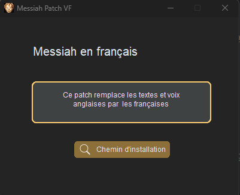

# Messiah-VF-Patch
Messiah-VF-Patch est un projet Python visant à fournir les voix et textes en français pour le jeu `Messiah`.

## Overview

Il suffit de cliquer sur le bouton et de fournir le dossier d'installation de `Messiah`.
Le logiciel s'occupe de copier les fichiers dans le répertoire d'installation sélectionné.



<div align="center">
  <a href="https://github.com/Aiola13/Messiah-VF-Patch/releases/latest">
    <b>Télécharger le patch</b>
  </a>
</div>

## Attention
Le patch ne sauvegarde pas les fichiers originaux. Si un problème se produit, vous devrez re-télécharger le jeu complet.

Une mise à jour viendra ajouter la sauvegarde et la récupération des fichiers originaux.

## Installation

### EXE
Vous pouvez directement télécharger la [release](https://github.com/Aiola13/Messiah-VF-Patch/releases/latest), compilée à partir de Github.


### PY
Pour utiliser le patch, vous aurez besoin de Python 3 et des bibliothèques suivantes :

- `tkinter`
  
Pour installer ces dépendances, utilisez la commande pip :

```bash
pip install tk
```

Pour lancer l'application, utiliser la commande `python` : 

```bash
python messiah_patch.py
```

## Contribution
J'apprécie toute contribution à ce projet. Si vous souhaitez contribuer, veuillez suivre les étapes suivantes :

- Forker le projet
- Créer une nouvelle branche (git checkout -b my-feature)
- Committer vos modifications (git commit -am 'Add some feature')
- Pusher la branche (git push origin my-feature)
- Créer une nouvelle Pull Request
  
## License
Messiah est sous licence MIT. Pour plus d'informations, consultez le fichier LICENSE.